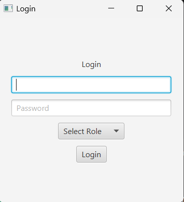
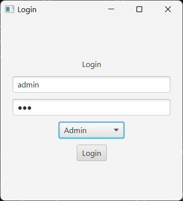
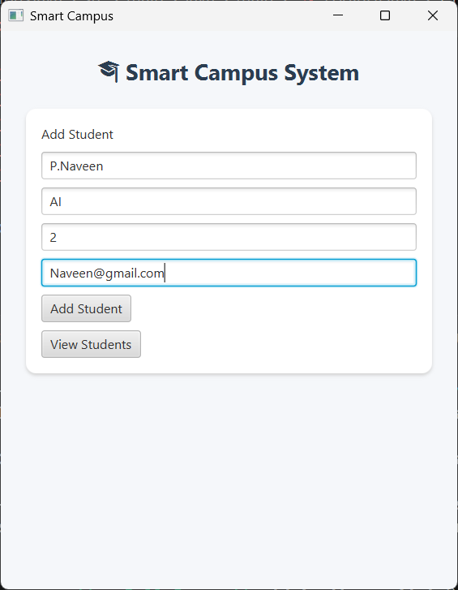
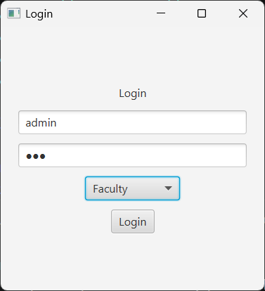
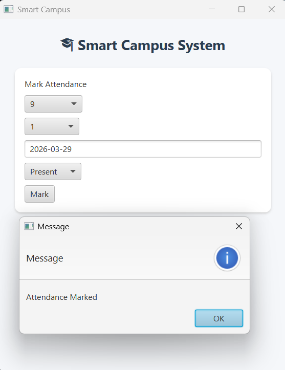
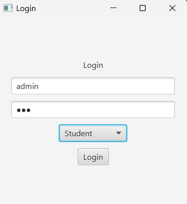
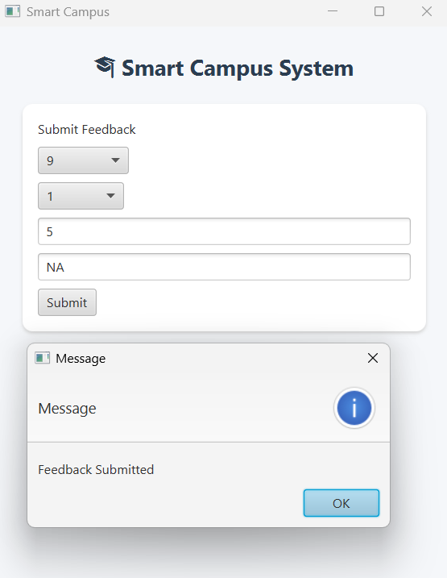

# 🚀 Smart Campus Management System

A Java-based desktop application designed to automate campus operations like student management, attendance tracking, and feedback handling.

---

## 🔧 Tech Stack
- Java (Core + JavaFX)
- MySQL
- JDBC
- Maven

---

## 🏗 Architecture
- DAO Design Pattern
- Modular structure:
  - StudentDAO
  - AttendanceDAO
  - FeedbackDAO
- Clean separation between UI and database logic

---

## ✨ Features
- Student data management
- Attendance tracking
- Course & faculty linkage using foreign keys
- Feedback management system
- Real-time database updates via JDBC

---

## 📚 What I Learned
- Designing normalized relational databases
- Handling foreign key constraints
- Implementing JDBC for real-time operations
- Structuring projects using Maven
- Writing clean and modular code

---

## 🚀 Future Improvements
- Convert to Spring Boot web application
- Add role-based authentication
- Build REST APIs
- Add analytics dashboard

---

## 📂 Project Structure
<pre>
SmartCampusJava/
│
├── src/
│   └── main/
│       └── java/
│           └── main/
│               ├── App.java
│               ├── StudentDAO.java
│               ├── AttendanceDAO.java
│               ├── FeedbackDAO.java
│               ├── LoginUI.java
│               ├── MainUI.java
│               └── ViewDataUI.java
│
└── pom.xml
</pre>
---

## 📸 Screenshots

## 🤝 Contribution
Feel free to fork this repository and contribute.

